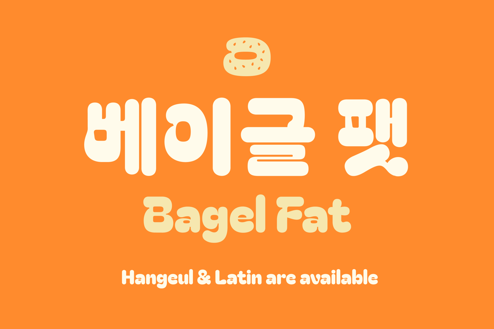
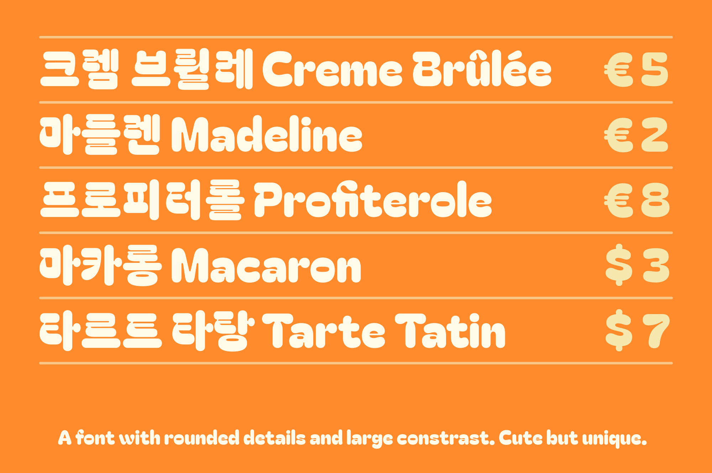

# Bagel Fat

## Basic Information
‘Bagel Fat’ is a very heavy/fat font with rounded details. By these rounded corners, the overall mood is cute and lovely which is inspired by bread, pastries and sweets. Also a large contrast at where the horizontal and the vertical stroke come across makes it unique, not just cute.

## Including characters
Hangeul(KS X 1001+additional characters), Latin(Google Latin Plus), Marks and Symbols

## Designer
Kyungwon Kim(kimkeiyard@gmail.com)
